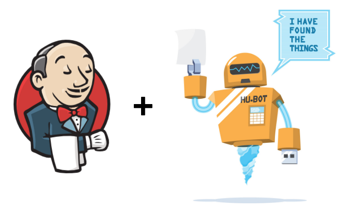
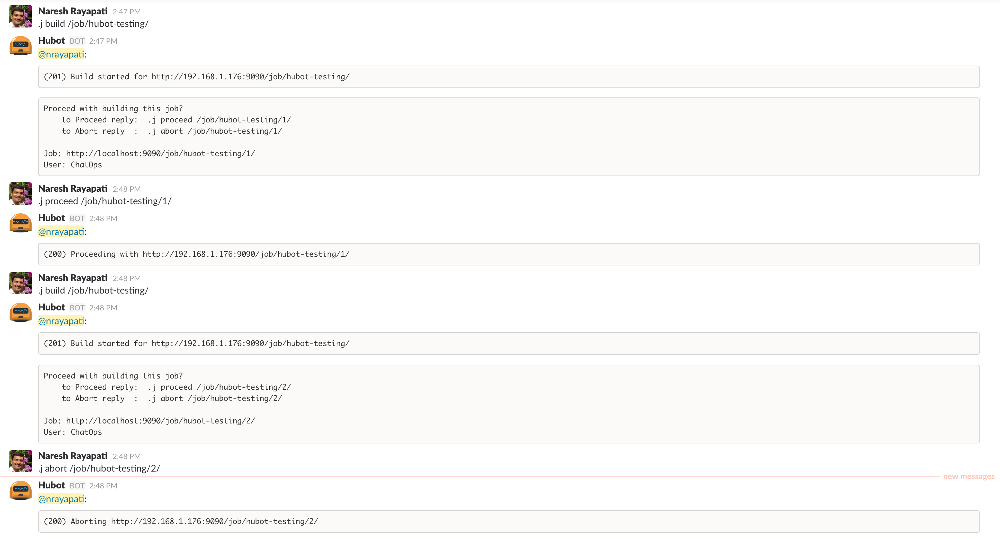
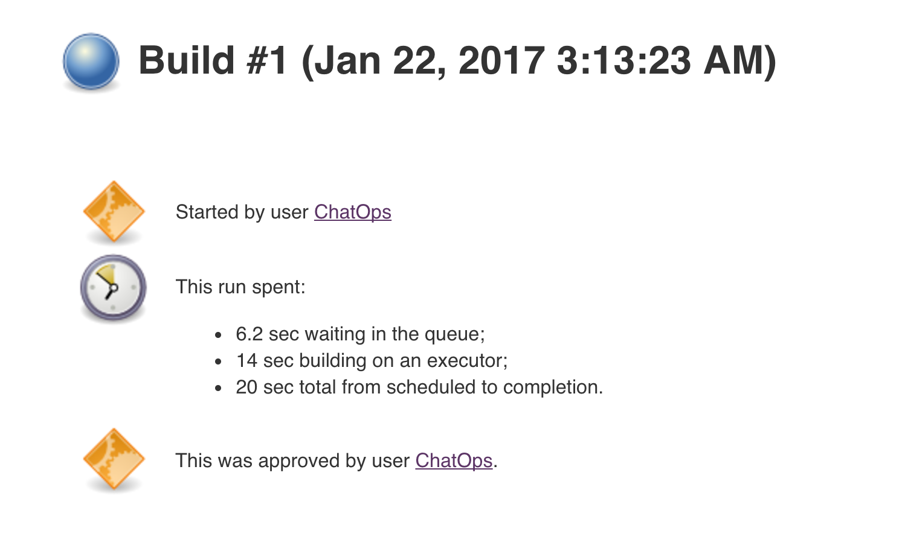
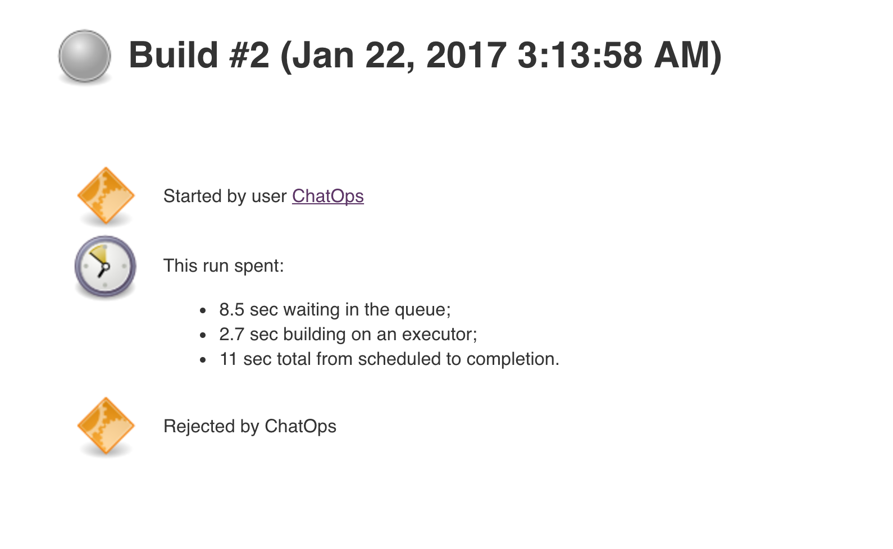
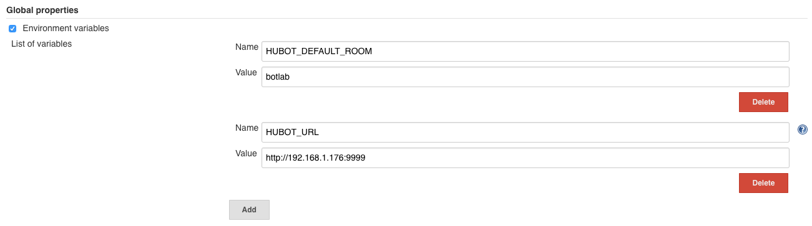
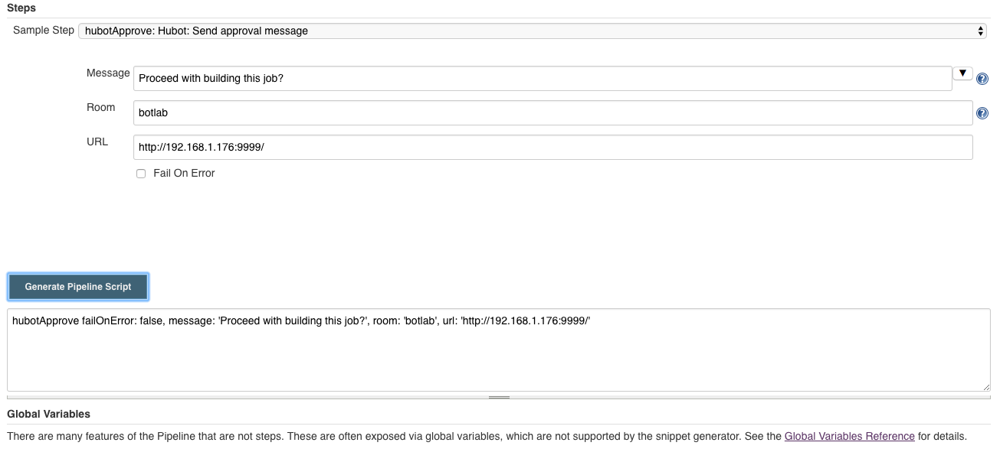
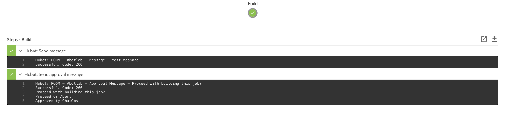

= Hubot Pipeline Steps
:toc: macro
:note-caption: :information_source:
:tip-caption: :bulb:

link:https://ci.jenkins.io/job/Plugins/job/hubot-steps-plugin/job/master/[image:https://ci.jenkins.io/job/Plugins/job/hubot-steps-plugin/job/master/badge/icon[Build]] image:https://img.shields.io/badge/License-Apache%202.0-blue.svg[License] link:https://plugins.jenkins.io/hubot-steps[image:https://img.shields.io/badge/Hubot%20Plugin-WIKI-blue.svg[Wiki]]

Jenkins Pipeline Steps for integration with the https://hubot.github.com/[Hubot Chat Bot] and with human approval.

'''
toc::[]

== Build

Run `mvn package` to build a deployable hpi bundle for Jenkins. Note this plugin **REQUIRES JDK 1.8** to build.

== Steps & Configuration

The following Jenkins pipeline steps are available if you add this plugin to your Jenkins.

=== **hubotSend**

Allows sending of a message to the hubot chat bot

[source,groovy]
----
hubotSend room: 'release', message: 'Releasing this project.', url: 'http://localhost:9999', failOnError: true
----

* `url` is optional, if it is provided as global environment variable `HUBOT_URL` or provided by `withEnv` step, this should always end with `/`, environment variable takes the lower precedence.

* `room` is optional, if it is provided as global environment variable `HUBOT_DEFAULT_ROOM` or provided by `withEnv` step, and room doesn't require `#`, it is added in the code, environment variable takes the lower precedence.

* `message` is required, actual message to be sent. Which is being prefixed with Job: #BUILD_URL string.

* `failOnError` is optional and by default it is `true`, if any error it won't abort the job., it can also be provided as global environment variable `HUBOT_FAIL_ON_ERROR`, environment variable takes the higher precedence.

=== **hubotApprove**

Sends a hubot message the project chat room for a project when the build is waiting for user input with the hubot commands to proceed or abort the build.

[source,groovy]
----
hubotApprove room: 'release', message: 'Proceed with building this Job?', url: 'http://localhost:9999/', failOnError: true
----

* `url` is optional, if it is provided as global environment variable `HUBOT_URL` or provided by `withEnv` step, this should always end with `/`, environment variable takes the lower precedence.

* `message` is required, actual message to be sent. Which is being prefixed with Job: #BUILD_URL string.

* `room` is optional, if it is provided as global environment variable `HUBOT_DEFAULT_ROOM` or provided by `withEnv` step, and room doesn't require `#`, it is added in the code, environment variable takes the lower precedence.

* `failOnError` is optional and by default it is `true`, if any error it won't abort the job., it can also be provided as global variable `HUBOT_FAIL_ON_ERROR`, environment variable takes the higher precedence.

* Example
+
[source,groovy]
----
node {
    // Note: HUBOT_URL and HUBOT_DEFAULT_ROOM set as global environment variables.
    stage('Build') {
        hubotApprove message: 'Proceed with building this job?'
    }
}
----
+

+
**Jenkins Approved Job**
+

+
**Jenkins Aborted Job**:

== Hubot Setup

=== New to hubot?

Refer to https://github.com/ThoughtsLive/hubot-base[hubot-base] to setup a either docker container or to run it locally.

TIP: Please replace scripts on hubot-base repo with the scripts under this hubot-steps repo and it is always a good idea to copy over the scripts from appropriate tag based on the version being installed on Jenkins.

=== Already running hubot.

Then just copy over following scripts from `scripts` folder.

* https://github.com/jenkinsci/hubot-steps/blob/master/scripts/hubot.coffee[hubot]
* https://github.com/jenkinsci/hubot-steps/blob/master/scripts/jenkins.coffee[jenkins]

== Examples

=== With Global Environment Variables

[source,groovy]
----
  hubotSend message: 'test message.'
  hubotApprove message: 'Proceed with building this job?'
----
=== withEnv Variables
[source,groovy]
----
  withEnv(['HUBOT_URL=http://192.168.1.176:9999','HUBOT_DEFAULT_ROOM=botlab','HUBOT_FAIL_ON_ERROR=false']) {
    hubotSend message: 'building job $BUILD_URL'
    hubotApprove message: 'Proceed with building this job?'
  }
----
=== No Environment Variables

Screenshot:

[source,groovy]
----
  hubotSend failOnError: false, message: 'testMessage', room: 'botlab', url: 'http://192.168.1.176:9999/'
  hubotApprove failOnError: false, message: 'Proceed with building this job?', room: 'botlab', url: 'http://192.168.1.176:9999/'
----

== Blue Ocean View

== Maintainers

* https://github.com/nrayapati[Naresh Rayapati]

== Disclaimer

Please don't hesitate to log a https://issues.jenkins-ci.org/secure/RapidBoard.jspa?rapidView=171&projectKey=JENKINS[JIRA] or github pull request if you need any help or if you can be of help with this plugin :).

Developed by https://github.com/nrayapati[Naresh Rayapati], this repo was initially cloned from https://github.com/ThoughtsLive/hubot-steps[ThoughtsLive]
