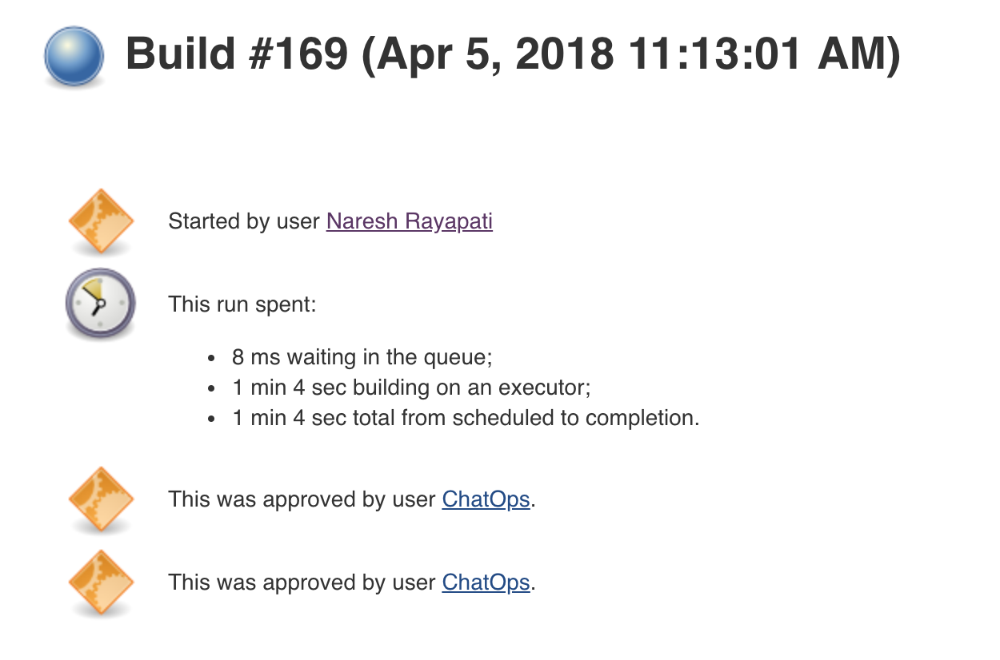
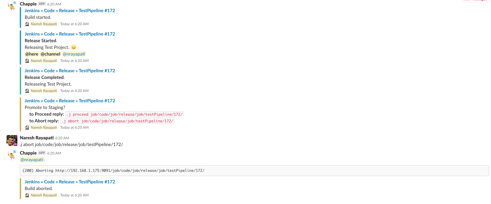
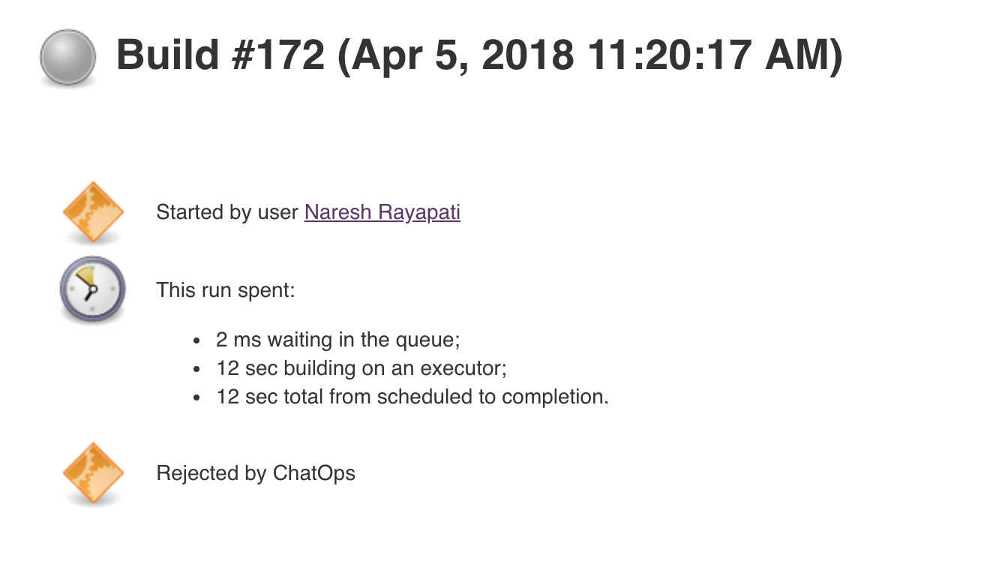

= Hubot Pipeline Steps
:toc: macro
:note-caption: :information_source:
:tip-caption: :bulb:

image:images/JenkinsPlusHubot.png[Jenkins,300]

link:https://ci.jenkins.io/job/Plugins/job/hubot-steps-plugin/job/master/[image:https://ci.jenkins.io/job/Plugins/job/hubot-steps-plugin/job/master/badge/icon[Build]] image:https://img.shields.io/badge/License-Apache%202.0-blue.svg[License] link:https://plugins.jenkins.io/hubot-steps[image:https://img.shields.io/badge/Hubot%20Plugin-WIKI-blue.svg[Wiki]]

Jenkins Pipeline Steps for integration with the https://hubot.github.com/[Hubot Chat Bot] and with human approval.

'''
toc::[]

== Configuration
=== **Hubot Site**
* *Default Site* `optional`, default to false. Default at folder level or Global level, when there are multiple default sites at the same level (Global or at a certain folder level), randomly picked.
* *Name* `required`, site name.
* *URL* `required`, hubot url, including port number, Ex: `https://localhost:9999/`.
* *Room* `optional`, room name, which can include #, depends on the chat service. Is optional when using folder name as room option.
* *Use Folder Name as Room* `optional`, by default is `false`, use folder name as room name.
* *Room Prefix* `optional`, only applicable for folder name as room option enabled. Ex: For personal organization folder @ required to send direct messages.
* *Fail On Error* `optional`, default `true`.
* *Advanced*
** *Build Notifications* `optional` - List of build notifications.
*** *Enabled* - Enable this notification.
*** *Type* - List of available build notifications.
*** *Room(s)* - `optional`, list of rooms, comma separated, when it is different from actual room name above.
*** *Token(s)* - `optional`, list of tokens, comma separated, refer to https://wiki.jenkins.io/display/JENKINS/Token+Macro+Plugin[Token Macro plugin] for more info. Ex: `'BUILD_DURATION, BUILD_URL'`. NOTE: no `${}` around token name.

=== **Global Config**
* List of Global Hubot Sites

=== **Folder Config**
* List of Hubot Sites

=== **Job Config**
* *Enable Notifications* - defaults to `false`.
* *Hubot Site Name* `optional`, given there is a default site at folder(or one of the parent folders) level/ global level.

== Build Notifications

Supports sending notifications for the following build statuses.

* Build Started.
* Build Aborted.
* Build Successful.
* Build Failed.
* Build Unstable.
* Build Back to Normal.
* Module not built.

== Pipeline Steps

The following Jenkins pipeline steps are available.

=== **hubotSend**

Sends a given message to site/room.

[source,groovy]
----
hubotSend message: 'Releasing Test project.'
----

* *message* `required`, actual message to send.
* *status* `optional`, text which can be used in script to differentiate. Ex: INFO, WARN, ERROR or SUCCESS - So that in Slack it can be used to decide card colors.
* *tokens* `optional`, list of tokens, comma separated, Refer to https://wiki.jenkins.io/display/JENKINS/Token+Macro+Plugin[Token Macro plugin] for more information.
* *extraData* `optional`, extra data like attachments in case of slack, Any kind of Map, given it is Serializable.
* *site* `optional`, hubot site name either it is from Folder Level or Global Level, Only used when *url* is not present. Optional, it will fallback to first default site that it found while searching from immediate folder to Global site configurations.
* *url* `optional`, if it is provided as global environment variable *HUBOT_URL* or provided by `withEnv` step, this should always end with `/`, environment variable takes the lower precedence.
* *room* `optional`, if it is provided as global environment variable *HUBOT_DEFAULT_ROOM* or provided by `withEnv` step, and room doesn't require `#`, it is added in the code, environment variable takes the lower precedence.
* *failOnError* `optional` and by default it is `true`, if any error it won't abort the job, it can also be provided as global environment variable *HUBOT_FAIL_ON_ERROR*, environment variable takes the lower precedence.

=== **hubotApprove**

Sends a hubot message the project chat room for a project when the build is waiting for user input with the hubot commands to proceed or abort the build.

[source,groovy]
----
hubotApprove message: 'Promote to Production?'
----

* *message* `required`, actual message to send.
* *status* `optional`, text which can be used in script to differentiate. Ex: INFO, WARN, ERROR or SUCCESS - So that in Slack it can be used to decide card colors.
* *tokens* `optional`, list of tokens, comma separated, Refer to https://wiki.jenkins.io/display/JENKINS/Token+Macro+Plugin[Token Macro plugin] for more information.
* *extraData* `optional`, extra data like attachments in case of slack, Any kind of Map, given it is Serializable.
* *site* `optional`, hubot site name either it is from Folder Level or Global Level, Only used when *url* is not present. Optional, it will fallback to first default site that it found while searching from immediate folder to Global site configurations.
* *url* `optional`, if it is provided as global environment variable *HUBOT_URL* or provided by `withEnv` step, this should always end with `/`, environment variable takes the lower precedence.
* *room* `optional`, if it is provided as global environment variable *HUBOT_DEFAULT_ROOM* or provided by `withEnv` step, and room doesn't require `#`, it is added in the code, environment variable takes the lower precedence.
* *failOnError* `optional` and by default it is `true`, if any error it won't abort the job, it can also be provided as global environment variable *HUBOT_FAIL_ON_ERROR*, environment variable takes the lower precedence.
* *id* `optional`, defaults to *Proceed*, refer to https://jenkins.io/doc/pipeline/steps/pipeline-input-step/[input step] for more information.
* *submitter* `optional`, comma separated list of users who can provide input. Refer to https://jenkins.io/doc/pipeline/steps/pipeline-input-step/[input step] for more information.
* *ok* `optional`, Proceed button label, Refer to https://jenkins.io/doc/pipeline/steps/pipeline-input-step/[input step] for more information.
* *submitterParameter* `optional` If specified, this is the name of the return value that will contain the ID of the user that approves this input. Refer to https://jenkins.io/doc/pipeline/steps/pipeline-input-step/[input step] for more information.
* *parameters* `optional`, Request that the submitter specify one or more parameter values when approving. Refer to https://jenkins.io/doc/pipeline/steps/pipeline-input-step/[input step] for more information.

==== Example

[source,groovy]
----
hubotSend message: "*Release Started*. \n Releasing Test Project. :sunny: \n<!here> <!channel> <@nrayapati> ", tokens: "BUILD_NUMBER,BUILD_ID", status: 'STARTED'

hubotSend message: "*Release Completed*. \n Releaseing Test Project.", tokens: "BUILD_NUMBER,BUILD_ID", status: 'SUCCESS'

hubotApprove message: 'Promote to Staging?', tokens: "BUILD_NUMBER, BUILD_DURATION", status: 'ABORTED'

hubotSend message: "*Staging Deployment Successful...* \n Deployed Test Project to 192.168.1.175 node.", tokens: "BUILD_NUMBER,BUILD_ID", status: 'SUCCESS'

hubotApprove message: 'Promote to Production?', tokens: "BUILD_NUMBER, BUILD_DURATION", status: 'ABORTED'

hubotSend message: "*Hooray! Went to Prod... :satisfied:* \n Deployed Test Project to prod(10.12.1.191) node.", tokens: "BUILD_NUMBER,BUILD_ID", status: 'SUCCESS'
----

**Jenkins Approved Job**

**Jenkins Aborted Job**:

== Hubot Setup

=== New to hubot?

Refer to https://github.com/ThoughtsLive/hubot-base[hubot-base] to setup a either docker container or to run it locally.

TIP: Please replace scripts on hubot-base repo with the scripts under this hubot-steps repo and it is always a good idea to copy over the scripts from appropriate tag based on the version being installed on Jenkins.

=== Already running hubot.

Then just copy over following scripts from `scripts` folder (jenkins, and one of the hubot scripts based on chat service you are using.). These are just examples and can be modified based on chat service / per the actual needs.

* https://github.com/jenkinsci/hubot-steps/blob/master/scripts/hubot_slack.coffee[hubot_slack]
* https://github.com/jenkinsci/hubot-steps/blob/master/scripts/hubot.coffee[hubot]
* https://github.com/jenkinsci/hubot-steps/blob/master/scripts/jenkins.coffee[jenkins]

== Examples

==== Default Site at Folder/Global level.

[source,groovy]
----
hubotSend message: 'test message.'
hubotApprove message: 'Proceed with building this job?'
----
==== With Site Name either at Folder or Global level.

[source,groovy]
----
hubotSend message: 'test message.', site: 'release'
hubotApprove message: 'Proceed with building this job?', site: 'release'
----

==== Site with Folder Name as Room.

[source,groovy]
----
hubotSend message: 'test message.', site: 'release'
hubotApprove message: 'Proceed with building this job?', site: 'release'
----

==== With Global Environment Variables / No Default Site at Folder/Global level.
image::images/global.png[Global,900]

[source,groovy]
----
hubotSend message: 'test message.'
hubotApprove message: 'Proceed with building this job?'
----
==== withEnv Variables / No Default Site at Folder/Global level.
[source,groovy]
----
withEnv(['HUBOT_URL=http://192.168.1.176:9999','HUBOT_DEFAULT_ROOM=botlab','HUBOT_FAIL_ON_ERROR=false']) {
  hubotSend message: 'building job $BUILD_URL'
  hubotApprove message: 'Proceed with building this job?'
}
----
==== No Environment Variables

Screenshot:

image::images/pipeline_syntax.png[Pipeline Syntax,900]

[source,groovy]
----
hubotSend failOnError: 'false', message: 'testMessage', room: 'botlab', url: 'http://192.168.1.176:9999/'
hubotApprove failOnError: 'false', message: 'Proceed with building this job?', room: 'botlab', url: 'http://192.168.1.176:9999/'
----

== Blue Ocean View

image::images/blueocean.png[BlueOcean,900]

== Known Issues

* https://github.com/jenkinsci/hubot-steps/blob/master/scripts/hubot.coffee[hubot] script doesn't work when *Prevent Cross Site Request Forgery exploits* enabled in Configure Global Security, need to modify script to query crumb before actual request.

== Maintainers

* https://github.com/nrayapati[Naresh Rayapati]

== Disclaimer

Please don't hesitate to log a https://issues.jenkins-ci.org/secure/RapidBoard.jspa?rapidView=171&projectKey=JENKINS[JIRA] or github pull request if you need any help or if you can be of help with this plugin :).
Refer to the link:./CONTRIBUTION.adoc[contribution guide] for more information.

Developed by https://github.com/nrayapati[Naresh Rayapati], this repo was initially cloned from https://github.com/ThoughtsLive/hubot-steps[ThoughtsLive]
